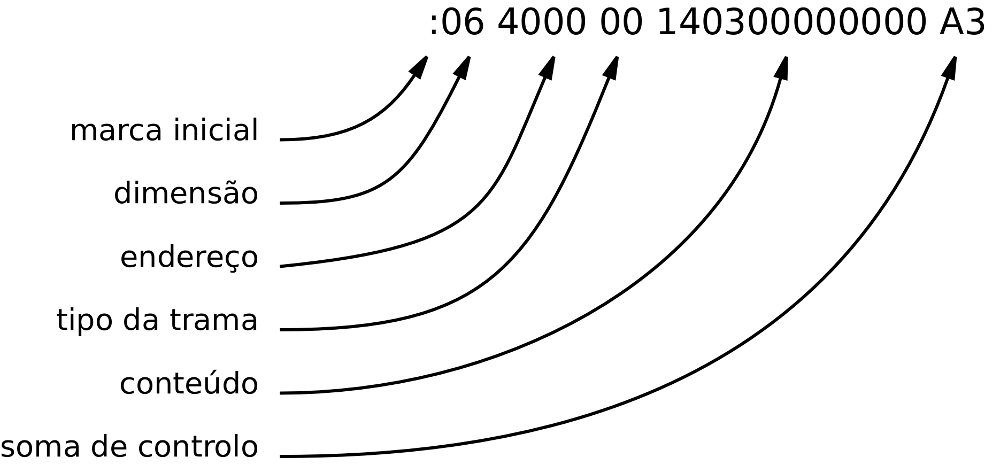

Utilização
==========

Invocação
---------

O PAS é invocado na janela de comando segundo a seguinte sintaxe:

   .. code-block:: console

      pas [options] <source filename>

      options:
         --verbose
         -h, --help
         -v, --version
         -i, --input <source filename>
         -o, --output <base filename>
         -s, --section <section name>=<address>
         -f, --format hexintel | binary | logisim8 | logisim16
         -a, --addresses <from>-<to>
         -l, --interleave

Os erros e avisos são assinalados na janela de comando utilizada na invocação.

O ficheiro com o texto do programa em linguagem *assembly* -- ficheiro fonte --
assinalado como `<source filename>`, tem normalmente a extensão **'s'**.

.. No caso de não serem detetados erros, é gerado um ficheiro com extensão **'lst'**,
   com informação legível, e um ficheiro com o código binário.

A opção ``--output`` permite definir o nome base [#f2]_ dos ficheiros de saída.
Se esta opção for omitida, os ficheiros produzidos terão
o mesmo nome base do ficheiro fonte
e serão localizados na mesma diretoria.

A opção ``--section`` permite definir o endereço de localização das secções.
Em caso de omissão desta opção as secções são localizadas a partir do endereço 0x0000,
pela ordem com que estão escritas no ficheiro fonte.

A opção ``--format`` permite definir o formato do ficheiro de saída com o código binário do programa.
A omissão desta opção é equivalente a ``--format hexintel``.

Formatos possíveis para o ficheiro com o código binário:

* ``--format hexintel``: ficheiro binário em formato Intel HEX;
* ``--format binary``: o conteúdo do ficheiro binário é uma imagem exata da memória;
* ``--format logisim8``: ficheiro binário em formato Logisim, organizado em palavras de 8 *bits*;
* ``--format logisim16``: ficheiro binário em formato Logisim, organizado em palavras de 16 *bits*.

A opção ``--addresses`` permite definir a gama de endereços cujo conteúdo é transcrito para o ficheiro binário de saída.
O conteúdo respeitante a endereços fora do intervalo especificado é excluido do ficheiro binário de saída.

A opção ``--interleave`` faz com que o código binário do programa seja repartido por dois ficheiros
-- um com os *bytes* respeitantes aos endereços pares
e outro com os *bytes* respeitantes aos endereços ímpares.
Esta opção é ignorada se também for mencionada a opção ``--format logisim16``.

.. _Localizacao_seccoes:

Localização das secções
-----------------------
A definição da localização em memória de cada secção pode ser explícita ou implícita.

A localização explícita é definida através da opção ``--section`` na invocação do PAS.

A localização implícita aplica-se às secções omissas na localização explicita,
localizando-as a seguir ao último endereço ocupado pela secção
anterior, pela ordem em que estão escritas no ficheiro fonte do programa.

No caso de não ser explicitada a localização da primeira secção definida no programa,
esta é localizada no endereço 0x0000.

No caso da secção estar fragmentada, e aplicando-se a localização implícita,
a sua localização é definida pela posição do primeiro fragmento.

O início de uma secção é localizado num endereço par.

Formatos de saída
-----------------

O código binário do programa é guardado em ficheiro num de três formatos:
formato Intel HEX [#f1]_, formato binário e formato do simulador Logisim.

O conteúdo das secções .stack e .bss não é transposto para os ficheiros de saída.

Formato binário
^^^^^^^^^^^^^^^

No formato binário o conteúdo do ficheiro produzido é a imagem exata do conteúdo
da memória do sistema.
O primeiro *byte* do ficheiro corresponde ao endereço da primeira secção.
Ao que se segue o restante conteúdo da primeira secção e das secções seguintes.
Se existirem intervalos de espaço de endereçamento entre secções,
serão preenchidos com o valor zero.

Formato Logisim
^^^^^^^^^^^^^^^

O simulador Logisim simula dispositivos de memória RAM ou ROM, cujo conteúdo pode
ser carregado a partir de ficheiro.

Na utilização do Logisim na simulação de sistemas baseados no P16
é necessário carregar nesses dispositivos o código binário dos programas,
produzido pelo PAS.

No Logisim os dispositivos de memória podem ter palavras com qualquer número de bits.
Em ficheiro, o conteúdo da memória é guardado em formato de texto, como uma sequência
de valores numéricos representados em base hexadecimal,
em que cada valor corresponde a uma posição de memória.

As ocorrências de sucessivos valores iguais são representadas pela sequência N*X.
Sendo N o número de vezes que o valor ocorre e X o valor em si.

O PAS gera ficheiros binários em formato Logisim para memórias com palavras de 8 ou 16 *bits*.

Exemplo de utilização
---------------------

Considere-se o programa da :numref:`ficheiro_multiply_s` como conteúdo do ficheiro ``multiply.s``.

**Código fonte:** :download:`multiply.s<code/multiply.s>`

.. literalinclude:: /code/multiply.s
   :language: asm
   :linenos:
   :caption: Ficheiro ``multiply.s``
   :name: ficheiro_multiply_s

.. rubric:: Invocação

No comando

   ``pas multiply.s -s .data=0x4000 -s .text=0x1000``

a primeira ocorrência da opção ``-s`` define o endereços da secção ``.data`` em ``0x4000``
e a segunda ocorrência define o endereço da secção ``.text`` em ``0x1000``.
A omissão de outras opções define que:
os ficheiros de saída terão os mesmos nomes base -- ``multiply.*``;
o ficheiro com o código binário terá o formato HEX Intel;
o conteúdo binário não é filtrado por endereço;
não serão gerados dois ficheiros binários com os dados intercalados.

.. rubric:: Mensagens de erro e de aviso

Foram introduzidas modificações no ficheiro fonte
para exemplificar e emissão de mensagens.

O primeiro caso é um erro de sintaxe -- a definição duma mnemónica de instrução inexistente (ld).

.. code-block:: console

   multiply.s (51): 	ld	r0, addressof_m
   ----------------     ^^
   ERROR!	syntax error

O segundo caso é um erro de domíno -- é escrito o número 17
na posição de uma constante cujo domínio vai de 0 a 15.

.. code-block:: console

   multiply.s (90): 	sub	r1, r1, 17
   ----------------                     ^^
   WARNING!	Expression's value = 17 (0x11) not encodable in 4 bit, truncate to 1 (0x1)

Se forem assinaladas apenas mensagens de aviso o processamento prossegue com a
geração dos ficheiros de saída -- ``multiply.lst`` e ``multiply.hex``.
Note-se  que faz parte das boas práticas de programação corrigir o programa
até suprimir a emissão de mensagens de aviso.

.. rubric:: Organização

Por uma questão de organização, é conveniente criar especificamente uma directoria para alojar os
ficheiros relacionados com um dado programa. No exemplo seguinte a directoria ``multiply`` aloja
todos os ficheiros relacionados com este programa: ``multiply.s``, ``multiply.lst`` e ``multiply.hex``.

.. code-block:: console

   disciplinas
      |-- pe
      |-- ss
      |-- ac
         |-- documents
         |-- p16_code
            |-- divide
            |-- multiply
               |-- multiply.s
               |-- multiply.lst
               |-- multiply.hex

.. rubric:: Ficheiro lst

O ficheiro de extensão ``lst`` contém a tabela de secções,
a tabela de símbolos e a listagem das instruções.

Na tabela de secções listam-se as secções existentes, as gamas de endereços que ocupam e as
respectivas dimensões. A secção ``.startup`` é localizada no endereço ``0x0000``, por localização implícita,
porque está definida em primeiro lugar no ficheiro fonte. As secções .text e .data são localizadas,
respetivamente, nos endereços 0x1000 e 0x4000 por localização explícita.
A secção .stack é localizada no endereço ``0x4006``, por localização implícita,
porque está definida a seguir a ``.data`` que tem a dimensão 6.

Na tabela de símbolos listam-se os símbolos definidos através de *label* ou através da directiva ``.equ``.
Por cada símbolo é dada a seguinte informação: identificador, tipo, valor associado e secção a que pertence.

Na listagem das instruções, são apresentados do lado esquerdo, na primeira coluna o número da linha
do ficheiro fonte, na segunda coluna os endereços da memória e na terceira e quarta colunas o respectivo conteúdo.

Na arquitectura do P16 as palavras formadas por dois *bytes* – designadas por *word* – ocupam duas
posições de memória consecutivas, o *byte* de menor peso toma a posição de endereço menor
e o *byte* de maior peso, a posição de endereço maior – *little ended format*.

O conteúdo da memória – código das instruções ou valor das variáveis – é escrito na terceira e quarta colunas
como uma sequência de *bytes* pela ordem dos endereços que ocupam na memória. Por exemplo, na
linha 7, o código máquina da instrução ``add	lr, r0, 4``, que ocupa os endereços ``0008`` e ``0009``, e tem o valor
``0xA20E``, é representado pela sequência de *bytes* ``0E`` ``A2``. Por exemplo, na linha 29,
a variável ``m``, do tipo ``.byte``, ocupa o endereço ``0x0046`` e o seu valor é ``20 (0x14)``.

.. literalinclude:: /code/multiply.lst
   :language: none
   :caption: Ficheiro ``multiply.lst``
   :name: ficheiro_multiply_lst

.. rubric:: Ficheiro hex

O ficheiro de extensão ``hex`` contém a informação binária do programa em formato Intel HEX.
A informação é composta pelo código binário das instruções ou os valores iniciais das variáveis
e a indicação dos endereços de memória onde serão carregados.

.. literalinclude:: /code/multiply.hex
   :language: none
   :caption: Ficheiro ``multiply.hex``
   :name: ficheiro_multiply_hex

O seu conteúdo é composto por tramas, formadas por uma marca inicial, a dimensão dos dados,
o endereço onde os dados serão carregados, o tipo da trama, os dados contidos na trama e um código
para detecção de eventual corrupção dos dados – soma de controlo.

   Formato de uma trama Intel Hex.

A soma de contolo é calculada de modo que a adição, em módulo 0x100,
de todos os *bytes* que formam a trama, some zero.

A trama ``:00 0000 01 FF`` tem dimensão zero, invoca virtualmente o endereço zero
e é do tipo ``01`` -- *end of file*, o que conjuntamente suscita a soma de controlo ``FF``.
Serve para terminar o ficheiro.

.. rubric:: Footnotes

.. [#f1] https://en.wikipedia.org/wiki/Intel_HEX

.. [#f2] Nome do ficheiro excluindo a extensão.
